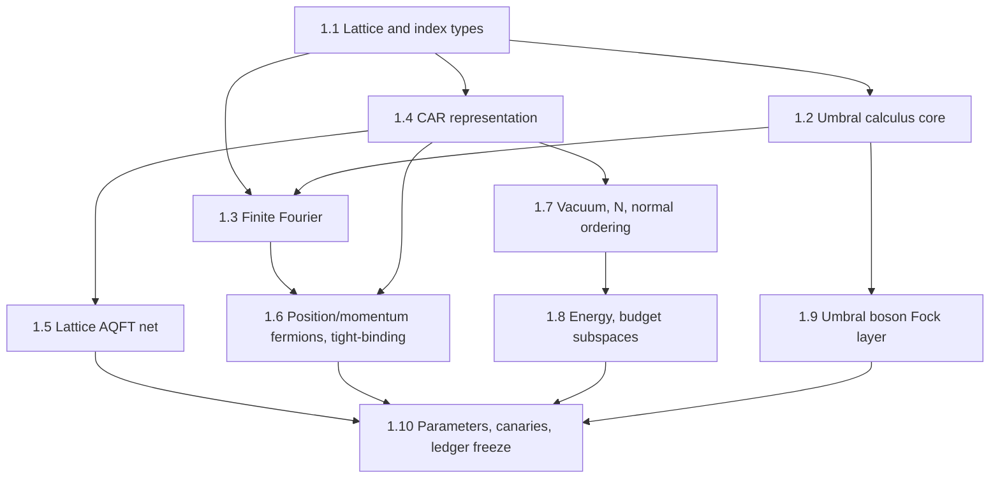

# Detailed Plan — Phase 0 (Environment & Design Freeze) and Phase 1 (Foundations)

**Version:** 1.0.0 · **Date:** 2026-10-03 · **Parent:** [`roadmap_v1.0.0.md`](roadmap_v1.0.0.md)

Legend: ☐ todo · ◐ in progress · ☑ done. *infra* = no mathematical content (no spec/oracle needed).
Lean snippets below are **sketches** — names must be confirmed against the pinned Mathlib
(`docs/MATHLIB_AUDIT.md`) before use.

---

# PHASE 0 — Environment, audit, design freeze → Gate G0

**Goal.** Everything needed to start Phase 1 is installed, pinned, reproducible and self-tested;
the design choices that Phase 1 depends on are written down as ADRs.

## 0.1 Lean toolchain *(infra)*
- ☑ Install `elan` user-locally (`~/.elan`, no sudo).
- ☑ Lake project **in this directory** (`lakefile.toml`, package `bosonize`, lib `Bosonize`),
  Mathlib pinned to a release tag; `autoImplicit = false`, `relaxedAutoImplicit = false`.
- ☑ `lake exe cache get` (prebuilt oleans — never build Mathlib from source), `lake build` green.
- ☑ Smoke tests `Bosonize/Basic.lean` (Finset sums, `Polynomial`, `ZMod`, `Matrix (Fin 2) (Fin 2) ℂ`)
  and `Bosonize/Audit/AxiomCheck.lean` (`#print axioms`).
- ☑ `docs/ENV.md`: elan / Lean / Lake versions, Mathlib tag + commit, build time.
- ☑ Editor: VS Code/Antigravity extension `leanprover.lean4`.

**Done when:** `scripts/check_env.sh` exits 0 from a fresh shell.

## 0.2 Repository scaffold *(infra)*
- ☐ `git init`, `.gitignore` (`.lake/`, LaTeX aux, `__pycache__/`, `.venv/`).
- ☐ Directories: `Bosonize/{Core,Stubs,Continuum,Audit}`, `docs/{adr,spec,gates}`,
  `notes/{md,tex}`, `oracle/{src,tests,mutants,reports}`, `scripts/`, `tests/canary/{good,bad}`, `logs/`.
- ☐ Ledger skeletons: `docs/ASSUMPTIONS.md`, `docs/WINDOWS.md`, `docs/NOTATION.md`,
  `docs/WATCHLIST.md`, `docs/trace.csv` (header only), `docs/MATHLIB_AUDIT.md`.

## 0.3 Python oracle environment *(infra)*
- ☐ `oracle/pyproject.toml` managed by `uv` (Python 3.12; `numpy`, `scipy`, `sympy`, `pytest`).
- ☐ Port `start_draft/probe_*.py` into `oracle/tests/test_seed_*.py` (CCR window, Schwinger sign,
  Sugawara) — they must reproduce draft Appendix C.
- ☐ `uv run pytest -q` green.

## 0.4 LaTeX + Markdown notes skeleton *(infra)*
- ☐ `notes/tex/main.tex` (amsart/report, `amsmath, amsthm, mathtools, hyperref, cleveref, tikz`),
  `notes/tex/macros.tex` (shared macros: `\Zl`, `\Shift`, `\Diff`, `\ff{x}{n}`, `\CAR`, `\Net`,
  `\nord{·}`), one `chapters/chNN-*.tex` per Phase-1 step, `refs.bib` (bibtex — biblatex is not installed).
- ☐ `notes/md/00-index.md` + one template note per step.
- ☐ `latexmk -pdf` builds `main.pdf` without errors.

## 0.5 Guards and canaries *(infra)*
- ☐ `scripts/anti_cheat.sh`: grep ban list of roadmap §6.1 in `Bosonize/Core/`; fail on hit;
  fail if `Core` imports `Stubs` or `Continuum`.
- ☐ `Bosonize/Audit/AxiomCheck.lean`: `#print axioms` on every Core theorem; script parses output
  and fails on anything outside `{propext, Classical.choice, Quot.sound}`.
- ☐ `tests/canary/bad/*.lean` (one per banned construct) and `tests/canary/good/*.lean`;
  `scripts/selftest_guards.sh` must reject all bad, accept all good.
- ☐ (Later in P1) statement lock: `scripts/lock_statements.py` hashes `pp.all` types of locked names.

## 0.6 Library audit (math-facing, but mechanical)
Record `#check` output (or *absent*) in `docs/MATHLIB_AUDIT.md` for everything Phase 1 needs:

| Area | Names to verify |
|---|---|
| Lattice | `ZMod`, `ZMod.val`, `ZMod.natCast_self`, `Fin`, `Equiv` ℤ-band ↔ `ZMod L` |
| Umbral | `fwdDiff`, `fwdDiff_iter_eq_sum_shift`, `shift`-type lemmas, `descPochhammer`, `ascPochhammer`, `Polynomial.derivative`, `Polynomial.comp`, `Polynomial.taylor`, `Finset.sum_range_succ_sub_sum`, `Finset.sum_range_sub` (telescoping), `Finset.sum_sub_distrib`, Abel summation `Finset.sum_range_by_parts` |
| Fourier | `IsPrimitiveRoot`, `IsPrimitiveRoot.geom_sum_eq_zero`, `Complex.isPrimitiveRoot_exp`, `ZMod.toCircle`/characters, `Matrix.conjTranspose` |
| Algebras | `Module.End`, `LinearMap`, `Matrix`, `Matrix.kronecker`, `ExteriorAlgebra`, `CliffordAlgebra`, `FreeAlgebra`, `RingQuot`, `Algebra.adjoin`, `Subalgebra`, `StarSubalgebra`, `StarAlgHom`, `AlgEquiv`, `Commute`, `Ring.lie` / `⁅·,·⁆` |
| Bosons | `MvPolynomial`, `MvPolynomial.pderiv`, `MvPolynomial.constantCoeff`, `PowerSeries`, `Nat.Partition` |
| Order/sets | `Finset.powerset`, `Finset.card`, `Finset.sum_bij`, `Finset.filter` |

Also re-check (expected: *does not exist / not usable*) the external repos named in the drafts
(Physicslib4, `kencyke/quantum-system`, OSforGFF, Lean-QuantumInfo); default is **Mathlib only**.

## 0.7 Miranda ingest
- ☐ `docs/MIRANDA_REGISTRY.csv` from `../references-transcripts/miranda_2003/*.md`
  (one row per equation; status `UNSEEN|SUSPECT|ORACLE-OK|DERIVED-LEAN|CONTRADICTED|MISSING-SOURCE|OUT-OF-SCOPE`).
- ☐ `docs/WATCHLIST.md` seeded from draft Appendix B (W-01 … W-16).

## 0.8 Notation contract
- ☐ `docs/NOTATION.md`: symbol table (ASCII name, Lean name, type, LaTeX macro, Miranda glyph);
  spec machine-layer grammar (` ```spec ` blocks, `pow(x,n)`, `dag(A)`, `nord(·)`, no `^`).
- ☐ Typed indices: `Site L := ZMod L`, `Mode L` (ℤ-subtype band $-L/2<n\le L/2$), `BosonIdx Q`,
  `inductive Chirality | R | L`.
- ☐ `scripts/notation_lint.py` (forbid `^` and bare `/` in spec blocks).

## 0.9 ADRs (each: decision, ≥3 attacks, rollback plan)
| ADR | Question | Default proposal |
|---|---|---|
| 1 | Fock-space representation | interface `CARRep`; concrete instance on `Finset (Mode L) → ℂ` with sign $(-1)^{\#\{k\in S:k<i\}}$; spike vs `CliffordAlgebra` and Jordan–Wigner `Matrix.kronecker` |
| 2 | Index types | `ZMod L` for sites, ℤ-subtype for band, explicit `Equiv` |
| 3 | Normalization | unnormalized $J_m=\rho(-m)$, $[J_m,J_m^\dagger]=m$; $b_m=J_m/\sqrt m$ only in adapter |
| 4 | Klein factors | Miranda-style (needs T6) + explicit shift construction cross-check |
| 5 | Boson algebra layer | **umbral polynomial Fock rep** `MvPolynomial (BosonIdx Q) ℂ`, $b^\dagger_m=X_m\cdot$, $J_m = m\,\partial_m$; abstract `RingQuot (FreeAlgebra …)` for automorphisms |
| 6 | Exponentials | nilpotent truncated exponentials on budget; `PowerSeries` for formal identities |
| 7 | Interaction | smooth band-limited densities (draft §3.7) |
| 8 | Bogoliubov parametrization | $(c,s)$ with $c^2-s^2=1$ |
| 9 | Correlator machinery | formal-series / twisted group algebra; positivity not required |
| 10 | Junk-value policy | as roadmap §6.4 |
| **11** | **Umbral layer** | functions `ℤ → R` and `Site L → R` for Δ/E; polynomials for the umbral map; Heisenberg pair only on ℤ / polynomials (impossible in finite dim by the trace argument — this is *why* budget windows appear) |
| **12** | **AQFT net encoding** | regions = `Finset (Site L)` (and intervals as a sub-family); $\mathfrak A(I)$ = `Algebra.adjoin ℂ {c_j, c_j† : j ∈ I}` inside `Module.End ℂ Fock`; parity automorphism; twisted locality as a theorem |

## 0.10 LLM pipeline (Gemini) *(infra)*
- ☑ LiteLLM proxy (`localhost:4000`) has `GEMINI_API_KEY` in its environment.
- ☐ `scripts/gemini_call.py`: OpenAI-compatible call to the proxy, appends model/tokens to
  `logs/llm_usage.csv`; default model `gemini-3.8-flash`.
- ☐ `scripts/check_gemini.sh`: one 5-token request; exit 0 iff a reply arrives.

## 0.11 Phase-1 specs drafted
- ☐ `docs/spec/P1/S1.k-*.md` for each step in Phase 1 below (human layer + ` ```spec ` layer),
  with oracle tests where numeric.

## Gate G0 packet (≈20 min human review)
`check_env.sh` log · guard self-test log · `MATHLIB_AUDIT.md` (absent items!) · `NOTATION.md` ·
ADR-1, 5, 11, 12 summaries · oracle seed report · Phase-1 spec list.
**Pass:** guards effective, environment reproducible, ADRs frozen, no open critical findings.

---

# PHASE 1 — Foundations and the assumption base → Gate G1

Miranda §II–IV, App. A.1. **Goal:** define every primitive object and prove every "well-known"
fact later phases need. At G1 the ledger `docs/ASSUMPTIONS.md` is frozen.

Per step: **spec note** (`notes/md/` + `docs/spec/P1/`) → **oracle** (if numeric) →
**Lean stub** (`Bosonize/Stubs/`) → statement review & lock → **proof** (`Bosonize/Core/`) →
guards → **LaTeX chapter** (`notes/tex/chapters/`) → **trace row**.

Dependency order:



### 1.1 Lattice, band, index types — `Core/Lattice.lean`
- Defs: `Site L := ZMod L` with `[NeZero L]`; `Mode L := {n : ℤ // -L < 2*n ∧ 2*n ≤ L}`
  (band $-L/2<n\le L/2$ without ℕ division); `Chirality`; momentum label as data, not a real.
- Thms: `Fintype.card (Mode L) = L` for even `L`; `Equiv (Mode L) (ZMod L)` via cast;
  reduction of out-of-band $n$ (MIR-013).
- Hazards: `L/2` in ℕ, `ZMod 0 = ℤ`, wrap-around.

### 1.2 Umbral calculus core — `Core/Umbral.lean` (T0)
Two carriers: periodic fields `Site L → R` and lattice functions `ℤ → R` (`R` a commutative ring).
- Defs: shift `E` (`f ↦ fun x => f (x+1)`) as `Module.End`/`LinearMap`; `Δ := E - 1`,
  `∇ := 1 - E⁻¹`; on `ℤ → R` relate to Mathlib's `fwdDiff`.
- Thms (all exact):
  1. `E` is an algebra automorphism of `Site L → R`; `E^L = 1` on `Site L → R`.
  2. Discrete Leibniz: `Δ (f*g) = Δ f * g + E f * Δ g`.
  3. Telescoping / discrete FTC on the ring: `∑ x, Δ f x = 0`; on intervals of ℤ: `∑_{a≤x<b} Δf x = f b - f a`.
  4. Summation by parts on the ring: `∑ f * Δ g = - ∑ ∇ f * g`  (i.e. `Δ† = -∇`).
  5. Newton expansion: `E^n = ∑_k (n choose k) Δ^k` (cf. `fwdDiff_iter_eq_sum_shift`).
  6. Falling factorials (`descPochhammer`): `Δ x^{\underline n} = n x^{\underline{n-1}}` as polynomials,
     with $\Delta p := p\circ(X+1) - p$.
  7. **Umbral map** `Φ : R[X] →ₗ R[X]`, `X^n ↦ descPochhammer R n`, satisfies `Φ ∘ d/dX = Δ ∘ Φ`
     (needs `ℚ ⊆ R` or works over any comm. ring — to be checked).
  8. **Umbral Heisenberg pair** on `ℤ → R`: with `(β f) x = x * f (x-1)`, `Δ ∘ β - β ∘ Δ = 1`.
  9. **No-go in finite dimension** (motivation for budgets): no `A B : Matrix n n K`, `n>0`,
     `char K = 0`, with `A*B - B*A = 1` (trace argument).
- Oracle: sympy symbolic checks of 2, 4, 6, 7, 8 for random polynomials/functions.

### 1.3 Finite Fourier — `Core/Fourier.lean` (part of T1)
- Defs: `ζ := exp(2πi/L)` only through `IsPrimitiveRoot ζ L`; plane waves `e_k x = ζ^(k*x)`.
- Thms: orthogonality $\sum_{x\in\mathbb Z_L}\zeta^{(k-k')x}=L\,\delta_{kk'}$ (both index sets);
  DFT matrix $U$ unitary ($U U^\dagger = 1$); **Δ is diagonal**: $\Delta e_k=(\zeta^k-1)e_k$,
  $\nabla e_k=(1-\zeta^{-k})e_k$; Miranda (14′) and App. A.1 finite sums.
- Hazard: exponent sign conventions of Miranda (8) vs (9) (W-15) — oracle fixes them.

### 1.4 CAR representation — `Core/CAR.lean` (T2, ADR-1)
- `structure CARRep (ι) (V)` : operators `c, cdag : ι → Module.End ℂ V` with
  `c i * cdag j + cdag j * c i = if i = j then 1 else 0`, `c i * c j + c j * c i = 0`.
- Concrete instance: `Fock ι := Finset ι → ℂ` (occupation basis, `[LinearOrder ι]`), sign
  $(-1)^{\#\{k\in S:k<i\}}$; prove CAR; `Module.finrank = 2^card ι`.
- Two chiralities: one instance on `Chirality × Mode L` (all modes mutually anticommuting; Klein
  signs emerge later automatically).
- Adjoint: inner product on `Fock` (standard on `Finset ι → ℂ`), `cdag i = (c i)†`.

### 1.5 Lattice AQFT net — `Core/Net.lean` (T-AQFT, ADR-12)
- `𝔄 (I : Finset (Site L)) : StarSubalgebra ℂ (Module.End ℂ Fock)` generated by $c_j,c_j^\dagger$, $j\in I$.
- Thms: **isotony** `I ⊆ J → 𝔄 I ≤ 𝔄 J`; **parity** automorphism $\alpha(c_j)=-c_j$ and grading
  $\mathfrak A=\mathfrak A_+\oplus\mathfrak A_-$; **twisted locality**: for disjoint $I,J$,
  even elements of $\mathfrak A(I)$ commute with $\mathfrak A(J)$ and odd elements anticommute;
  **even subnet is local**; **additivity** $\mathfrak A(I\cup J)=\mathfrak A(I)\vee\mathfrak A(J)$;
  **irreducibility/size**: $\mathfrak A(\mathbb Z_L)=\operatorname{End}(\text{Fock})$ (dimension $4^L$).
- Translation covariance: shift on sites induces $*$-automorphism $\tau$ with $\tau(\mathfrak A(I))=\mathfrak A(I+1)$.
- Tier B: lattice Haag duality (twisted commutant of $\mathfrak A(I)$ is $\mathfrak A(I^c)$).

### 1.6 Position/momentum fermions; tight-binding — `Core/LatticeFermion.lean` (T1)
- $c_j = L^{-1/2}\sum_n \zeta^{nj} c_n$ (convention fixed by oracle); CAR in position basis
  (via unitarity of 1.3); local densities $n_j$; $\sum_j n_j=\sum_n n_n$.
- Tight-binding $H=-t\sum_j(c_j^\dagger c_{j+1}+h.c.)$ written with the **umbral** operator:
  $H = t\sum_j c_j^\dagger\big((\Delta+\nabla) c\big)_j - 2t\hat N$; diagonal in $k$:
  $H=\sum_n \varepsilon(n)\,c_n^\dagger c_n$, $\varepsilon(n)=-2t\cos(2\pi n/L)$ expressed via
  $\zeta^n+\zeta^{-n}$ (no `Real.cos` needed in the statement).
- Linearized (sawtooth) dispersion of Miranda §III introduced as a **definition** of $H_0=\sum_n n\,c^\dagger_nc_n$ (units $2\pi v/L$).

### 1.7 Vacuum, number, normal ordering — `Core/Vacuum.lean` (T2)
- Ω: occupied iff $n\le0$; $\hat N=\sum_n(\hat n_n-\langle \hat n_n\rangle_\Omega)$, $N(S)=|S|-L/2$.
- Normal ordering relative to Ω as an explicit definition on bilinears $\,:\!c^\dagger_a c_b\!:\,$;
  $\langle :\!X\!:\rangle_\Omega=0$.
- Sector ground states $|N\rangle_0$ ($|N|\le L/2$): normalized, mutually orthogonal, explicit
  phase convention; $\hat N|N\rangle_0=N|N\rangle_0$.

### 1.8 Energy and budget — `Core/Budget.lean` (T3)
- $P(S)=\sum_{n\in S}n-\sum_{n\le0}n$, $e(S)=P(S)-N(N+1)/2$ (stated as `2*e = 2*P - N*(N+1)` in ℤ).
- Thms: $e(S)\ge0$, $e(S)=0\iff S$ is the sector ground state; deep hole at depth $d$ has $e=d$.
- `Budget L K Nmax := span {basis S | e S ≤ K ∧ |N S| ≤ Nmax}` (+ projector `P_K`).
- **Energy-shift lemmas:** how $c_n, c^\dagger_n$ change $(N,P,e)$; closure properties.
- Oracle: `e ≥ 0` over all $2^L$ states, $L\le 12$; budget dimensions vs partition counts.

### 1.9 Umbral boson Fock layer — `Core/BosonFock.lean` (T-Bos, ADR-5)
- Carrier `MvPolynomial (BosonIdx Q) ℂ`; $a^\dagger_m := X_m\cdot$, $a_m := \partial_m$
  (`MvPolynomial.pderiv`); unnormalized $J^\dagger_m=X_m$, $J_m=m\,\partial_m$.
- Thms: exact CCR $[a_m,a^\dagger_{m'}]=\delta_{mm'}$, $[a_m,a_{m'}]=0$ as `Module.End` identities
  (no domain issues — the umbral Heisenberg pair of 1.2 in polynomial form);
  vacuum functional $\omega_0=$ `constantCoeff`, $\omega_0(a_m p)$ rules;
  number operator $\sum_m X_m\partial_m$ is the degree operator (Euler);
  monomials are eigenvectors (weighted degree = energy $\sum m\,r_m$).
- Nilpotent truncated exponential: on the weight-≤K subspace, $(\sum_m \lambda_m J_m)^{K+1}=0$,
  so $\exp_K$ is an honest exponential there.

### 1.10 Parameters, canaries, ledger freeze — `Core/Params.lean`
- `structure LatticeData` (`L`, `hL : Even L`, `[NeZero L]`), `structure Window (L K Nmax Q)`.
- Non-vacuity canaries at `L = 4, 6`: budget dimension > 1, window satisfiable.
- `docs/ASSUMPTIONS.md` lists A1–A9 (index types, umbral operators, root of unity, CAR rep,
  net, vacuum/normal order, energy/budget, boson Fock layer, parameter records) — **frozen at G1**.

### Phase-1 notes deliverables
| Step | Markdown note | LaTeX chapter |
|---|---|---|
| 1.1 | `notes/md/01-lattice.md` | `chapters/ch01-lattice.tex` |
| 1.2 | `notes/md/02-umbral.md` | `chapters/ch02-umbral.tex` |
| 1.3 | `notes/md/03-fourier.md` | `chapters/ch03-fourier.tex` |
| 1.4–1.5 | `notes/md/04-car-net.md` | `chapters/ch04-car-net.tex` |
| 1.6 | `notes/md/05-lattice-fermions.md` | `chapters/ch05-lattice-fermions.tex` |
| 1.7–1.8 | `notes/md/06-vacuum-budget.md` | `chapters/ch06-vacuum-budget.tex` |
| 1.9 | `notes/md/07-boson-fock.md` | `chapters/ch07-boson-fock.tex` |

Each chapter: definitions → theorems (with Lean names, `\leanref{…}`) → proofs → *Continuum
interpretation (not formalized)*.

### Acceptance (G1)
T0, T-AQFT (Tier A part), T1, T2, T3, T-Bos green under all guards; ledger complete and frozen;
canaries show non-trivial budget spaces; notes chapters 1–7 build in LaTeX.
**G1 packet:** ledger (read all of it — the single most important human review: are the
definitions what you mean physically?), locked definition list, trace rows, open findings.

### Suggested order & effort (indicative)
1.1 → 1.2 → 1.3 (week 1) · 1.4 spike + ADR-1 → 1.4 → 1.5 (weeks 2–3) · 1.6, 1.7 (week 3) ·
1.8 (week 4) · 1.9 (parallel with 1.4–1.8) · 1.10 + notes polish (week 5).

---

## Status log (Phase 0 implementation)

_Filled in as Phase 0 is executed — see bottom of this file after each session._

