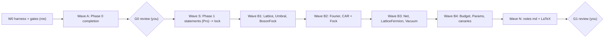

# Plan: finish Phase 0 + Phase 1 using Gemini workers on your API key

**Status of the starting point** (from the audit): infrastructure works (Lean + Mathlib pinned,
uv venv, LaTeX, LiteLLM proxy). The guards, Mathlib audit, oracle tests, ADRs and specs are
placeholders. The Phase 1 Lean code has **0 theorems**. The LaTeX does not include its chapters.

**Proxy status (checked today):** `gemini-3.8-flash` ✅ · `gemini-3.1-pro` ✅. The alias was broken
(404). I pointed it at `gemini/gemini-3.1-pro-preview` in `~/.local/litellm_config.yaml`; the
original is saved as `.bak`.

---

## 1. Who does what (quota strategy)

| Role | Who | Paid from |
|---|---|---|
| Orchestrator: writes task cards, launches waves, reads **gate summaries** (not full logs), reviews locked statements | me (Antigravity) | Antigravity quota — kept small |
| **Workers**: write Lean proofs, tests, notes, audits | `scripts/gworker.py` running Gemini through `localhost:4000` | **your Gemini prepaid credit** |
| Statement author / hard proofs / red team | `gemini-3.1-pro` | your credit (used sparingly) |
| Mechanical work, routine proofs, notes | `gemini-3.8-flash` | your credit (default) |

I will **not** use Antigravity `invoke_subagent` for this work, since that would bill my quota.
Workers run as plain background processes, so I only pay for launching them and reading a
summary of a few lines each.

## 2. The worker harness `scripts/gworker.py` (W0, written by me, ~200 lines)

An agent loop using OpenAI-style tool calls through LiteLLM:

- **Tools given to the model:** `read_file`, `write_file` (only paths listed in the task card),
  `lean_check <file>` (`lake env lean`, returns errors only, truncated), `grep_mathlib <regex>`
  (ripgrep over `.lake/packages/mathlib`, to stop invented lemma names), `run_tests`
  (`uv run pytest -q <path>`), `latex_build`, `finish <summary>`.
- **Task card** (`tasks/<id>.yaml`): goal, files it may write, read-only context files,
  acceptance command, model, `max_turns`, `max_tokens`, escalation rule.
- **Escalation:** Flash → (after N failed checks) Pro, given a summary of the failures →
  (still failing) the task is marked `BLOCKED` with a minimal report. I look at it then.
- **Budget control:** every call is logged to `logs/llm_usage.csv` (task, model, tokens in/out).
  The worker stops when it hits the task's token cap. A global cap per wave (`--wave-budget`)
  aborts the run if exceeded.
- **Parallel runs:** `scripts/run_wave.sh wave1` starts the workers in parallel (up to ~4). Full
  `lake build` runs are serialized with `flock`. Each worker checks single files with
  `lake env lean`.
- **Output:** `logs/tasks/<id>.json` holding status, turns, tokens, final gate result, and a
  summary of 5 lines or fewer. That summary is all I read.

## 3. Anti-cheat gates (written and self-tested before any proof work)

A task only counts as done when `scripts/gate.sh <id>` passes:

1. `lake build` green, with no warnings in `Bosonize/Core`.
2. `anti_cheat.sh`: no `sorry/admit/axiom/native_decide/opaque/unsafe/implemented_by/extern/maxHeartbeats/Tendsto/tsum/∫/deriv/MeasureTheory` in Core, and Core does not import Stubs/Continuum.
3. **Statement lock:** `scripts/lock_statements.py` hashes the elaborated type of every locked
   name (`Stubs/*.lean` ↔ `Core/*.lean`). A worker that weakens a statement fails the gate.
   Workers cannot write to `Stubs/`.
4. **Axiom audit:** a Lean script lists every constant in `Bosonize.Core.*` with
   `Lean.collectAxioms`. Anything other than `propext, Classical.choice, Quot.sound` fails.
5. **Non-vacuity canaries:** each bundled hypothesis or window has a concrete instance at `L = 4, 6`.
6. **Guard self-test:** `tests/canary/bad/*.lean` (one per banned construct, plus a weakened
   statement) **must** be rejected; `tests/canary/good/*.lean` must pass. This runs in CI
   (`scripts/check_all.sh`) before every wave.

## 4. Work packages and waves



### Wave A — finish Phase 0 (all in parallel)
| ID | Task | Model | Acceptance |
|---|---|---|---|
| A1 | Guards: canary files, real `selftest_guards.sh`, axiom-audit Lean script, `lock_statements.py` | Pro | self-test rejects every bad canary and accepts every good one |
| A2 | Mathlib audit: generate `Bosonize/Audit/MathlibAudit.lean` with `#check` for every name in `phase01.md` §0.6, run it, write `docs/MATHLIB_AUDIT.md` from **real output** (found / not found / renamed) | Flash | file compiles; every row backed by the log |
| A3 | Oracle: turn the 2 probes into pytest tests with assertions; add sympy tests for the umbral identities (Leibniz, summation by parts, $[\Delta,\beta]=1$, falling factorials) plus **mutants that must fail** | Flash | `pytest` ≥ 15 tests green; mutants killed |
| A4 | ADR-1, 5, 11, 12 in full (decision, ≥3 attacks, rollback); ADR-2,3,4,6–10 short | Pro | I review the ADR-1 and ADR-12 decisions (short) |
| A5 | Specs `docs/spec/P1/S1.1…S1.10` (human layer + ` ```spec ` layer, passing `notation_lint.py`) | Pro | lint passes; each spec maps to Lean names |
| A6 | `docs/MIRANDA_REGISTRY.csv` from the 3 transcripts (equations of §II–IV, App. A.1 first) + `WATCHLIST.md` from the draft's Appendix B | Flash | CSV parses; every Phase-1 equation has a row |
| A7 | `scripts/status.py` → generates the honest status table in `phase01.md` (proved / stated / missing) | Flash | runs in CI |

**G0 packet** (generated automatically): guard self-test log, audit table (the *missing* items
are what matter), ADR summaries, spec list. You approve it.

### Wave S — Phase 1 statements (Pro), then lock
Pro writes `Bosonize/Stubs/<Module>.lean` with every Phase-1 statement ending in `sorry`,
following the specs. Rules: junk-value policy (no ℕ subtraction or division in statements),
`NeZero L`, explicit positivity. **I review the statements**, which is cheap (just
signatures). You can optionally skim them as well. Then they are locked by hash.

### Wave B — proofs (Flash first, escalating to Pro)
| Wave | Module | Main content (T-ids) | Difficulty | Default model |
|---|---|---|---|---|
| B1 | `Core/Lattice` | centred band `Mode L` (restored), `card = L`, `Equiv` with `ZMod L` | low | Flash |
| B1 | `Core/Umbral` | T0: $E$ automorphism, $E^L=1$, Leibniz, telescoping, summation by parts, Newton series, falling factorials, umbral map, $[\Delta,\beta]=1$, trace no-go | low–med | Flash |
| B1 | `Core/BosonFock` | T-Bos: CCR on `MvPolynomial` via `pderiv`, Euler/degree operator, nilpotent truncated exponential | med | Flash → Pro |
| B2 | `Core/Fourier` | T1: orthogonality via `IsPrimitiveRoot`, DFT unitary, $\Delta e_k=(\zeta^k-1)e_k$ | med | Flash → Pro |
| B2 | `Core/CAR` | T2: `CARRep` **with relations**; concrete Fock instance on `Finset ι → ℂ` with the sign function; `finrank = 2^n` | **high** | Pro |
| B3 | `Core/Net` | T-AQFT: isotony, parity, twisted locality, even subnet local, additivity, translation covariance (Haag duality = Tier B, skipped) | high | Pro |
| B3 | `Core/LatticeFermion` | position fermions, tight-binding in umbral form, diagonal in $k$ | med | Flash → Pro |
| B3 | `Core/Vacuum` | Ω, $\hat N$, normal ordering, sector ground states | med | Flash |
| B4 | `Core/Budget` | T3: $e(S)\ge0$, $e=0$ iff ground state, budget subspaces, energy-shift lemmas | med–high | Flash → Pro |
| B4 | `Core/Params` | `LatticeData`, `Window`, canaries at L = 4, 6; ledger `ASSUMPTIONS.md` frozen | low | Flash |

### Wave N — notes that match the Lean (Flash)
- `scripts/extract_statements.py` dumps every **proved** Core declaration (name, type, docstring) to JSON.
- Flash writes `notes/md/0k-*.md` and `notes/tex/chapters/ch0k-*.tex` **from that JSON**. Every
  theorem gets `\leanref{Bosonize.Core....}`.
- `scripts/check_leanrefs.py` fails if a `\leanref` names a declaration that does not exist or
  is not proved. `main.tex` `\input`s every chapter. `latexmk -pdf` runs with no errors and no
  undefined references.
- Pro does one red-team pass: "does the text claim anything the Lean doesn't prove?"

## 5. Spending control

- Default model is Flash. Pro is used only for A1, A4, A5, Wave S, CAR, Net, and escalations.
- A token cap on every task. A per-wave cap that you set (e.g. **R$ 30 for Wave A**, **R$ 80 for all
  of Phase 1**). After Wave A I will take the real cost from `llm_usage.csv` and your AI Studio
  billing page, then adjust the caps before Wave B.
- My own quota: roughly 1 turn per wave to launch, 1 to read summaries, plus one statement review.
  I only open full logs for `BLOCKED` tasks.

## 6. Risks

| Risk | Mitigation |
|---|---|
| Flash invents Mathlib lemma names | `grep_mathlib` tool + `MATHLIB_AUDIT.md` in the context |
| Worker weakens a statement to make the proof go through | statement lock + Stubs are read-only to workers |
| CAR Fock instance (sign bookkeeping) stalls | ADR-1 fallback: Jordan–Wigner via `Matrix.kronecker` or `CliffordAlgebra`; Pro spike first |
| Twisted locality in `Net` is long | prove it on generators, then extend through `Algebra.adjoin` induction; Haag duality stays Tier B |
| Parallel workers corrupt the build | single-file checks + `flock` on full builds; each task writes disjoint files |
| Notes drift from the code | notes generated from extracted statements + `check_leanrefs.py` |

## 7. What I need from you

1. **Approve** this plan (Proceed button), or edit it.
2. **Budget caps:** is R$ 30 for Wave A and R$ 80 for Phase 1 OK?
3. **Review gates:** do you want to review the locked Phase-1 statements yourself (≈15 min), or
   only at G0/G1?

Once approved, I write W0 (harness + gates) myself, then start Wave A in the background.
