# BOSONIZE-LEAN — Overview Roadmap v1.0.0

**Date:** 2026-10-03 · **Supersedes:** `start_draft/roadmap_v0.md`, `start_draft/master_roadmap_part{1,2,3}.md`
(those drafts remain the detailed rationale; this file is the binding overview).
**Detailed plan for Phases 0–1:** [`phase01.md`](phase01.md).

---

## 1. Mission

Produce **Markdown + LaTeX notes** on bosonization of 1+1D spinless fermions in which every
mathematical claim is an **exact identity on a lattice-regularized AQFT**, expressed with
**umbral calculus**, and **machine-checked in Lean 4 + Mathlib** with zero axioms.

Headline target (the "duality theorem", informal):

> For even $L$ and budget parameters satisfying the proved window inequalities, the lattice CAR
> net on $\mathbb Z_L$ (two chiralities) contains a Heisenberg algebra of density modes acting on
> budget subspaces; the fermion field equals a Klein-factor-dressed vertex operator on budget; the
> free and interacting (Luttinger, smooth density–density) fermion Hamiltonians equal explicit
> quadratic boson Hamiltonians; a Bogoliubov **algebra automorphism** diagonalizes them; the
> exchange $(\varphi,\theta,g)\to(\theta,\varphi,1/g)$ is a symmetry; and the density and CDW
> correlators are exact finite expressions with $g$-scaling.

## 2. Method in one paragraph

**Regularize twice, never take a limit.** (i) *UV:* a ring of $L$ sites and a band of $L$ modes,
so the DFT is exact and δ-functions are Kronecker deltas. (ii) *IR/energy:* restrict to
**budget subspaces** of bounded excitation energy, which replaces the infinite Dirac sea.
**Umbral calculus** supplies the discrete replacement of every differential identity
($\partial\to\Delta$, $[\partial,x]=1\to[\Delta,xE^{-1}]=1$, $x^n\to x^{\underline n}$, Taylor →
Newton series) so continuum formulas have exact lattice twins. Bosons live in an **algebraic
(polynomial/umbral) Fock representation** where $b$ and $b^\dagger$ are derivations and
multiplications on polynomials — no unbounded operators, no domains. Local structure is encoded
as a **lattice AQFT net** of finite-dimensional $*$-algebras.

## 3. Truth hierarchy

1. Lean theorem (locked statement, guarded proof).
2. Dual numerical oracle (two independent implementations).
3. Two independent derivations that agree.
4. Miranda's text (OCR transcript; known defects, see `docs/WATCHLIST.md`).

## 4. Phases and gates

```mermaid
flowchart LR
  P0["P0 Environment, audit, design freeze"] --> G0{G0}
  G0 --> P1["P1 Foundations: lattice, umbral calculus, Fourier, CAR net, Fock, budget"]
  P1 --> G1{G1}
  G1 --> P2["P2 Densities, Heisenberg algebra, Sugawara, Haldane completeness"]
  P2 --> G2{G2}
  G2 --> P3["P3 Klein factors, Mattis-Mandelstam"]
  P3 --> G3{G3}
  G3 --> P4["P4 Free H0, dual fields phi/theta"]
  P4 --> G4{G4}
  G4 --> P5["P5 Luttinger model, Bogoliubov automorphism"]
  P5 --> G5{G5}
  G5 --> P6["P6 Correlators, duality theorem"]
  P6 --> G6{G6}
  G6 --> P7["P7 Audit, LaTeX book, release"]
```

| Phase | Content | Miranda (guide) | Headline outputs | Gate |
|---|---|---|---|---|
| **P0** | Lean/Mathlib pinned, Python oracle, LaTeX skeleton, guards + canaries, Mathlib audit, notation contract, ADRs, Gemini pipeline | — | green `lake build`, `check_env.sh`, `MATHLIB_AUDIT.md`, `NOTATION.md`, ADR-1…ADR-12 | G0 |
| **P1** | Lattice & index types; **umbral calculus core**; finite Fourier; **lattice CAR net (AQFT)**; Fock space, vacuum, $\hat N$, normal ordering; energy & budget; **umbral boson Fock layer**; ledger freeze | §II–IV, App. A.1 | T0 (umbral), T1–T3, T-AQFT | G1 |
| **P2** | Density operators $\rho(m)$; budget CCR with Schwinger term; Sugawara $\hat P-\hat N(\hat N+1)/2=\sum m b^\dagger_m b_m$; $H_0$ bosonic; Haldane completeness | §V, VI, X | T4, T5, T6 | G2 |
| **P3** | Klein factors; exact $[b,c]$ with edge terms; truncated exponentials & BCH; projected Mattis–Mandelstam; two chiralities | §VII–IX, XI, XII, App. B–C | T7, T8, T9 | G3 |
| **P4** | $H_0$ in three forms; $\varphi,\theta$; canonical commutators as finite sums; Mandelstam kernel (Tier B) | §X–XI, XIII | T10 | G4 |
| **P5** | Smooth-density Luttinger $H_{int}$; fermion → boson; Bogoliubov `AlgEquiv` in $(c,s)$ parametrization; zero modes; $g\leftrightarrow1/g$ | §XIV.1, App. D | T11–T14 | G5 |
| **P6** | Quasi-free state $\omega_d=\omega_0\circ\Theta^{-1}$; $D_c$; CDW correlator with $g$-scaling; Main Theorem | §XIV.2 | T15, MT1–MT6 | G6 |
| **P7** | Fresh-clone reproducibility, global red audit, coverage matrix, LaTeX book, limitations | — | release | G7 |

**Tiers.** A = must be proved; B = proved if A is green; C = optional, isolated in
`Bosonize/Continuum/` (real analysis allowed: $\alpha\to0$ limits, power laws, sawtooth).

## 5. Target theorem list

| ID | Statement (informal) | Phase | Tier |
|---|---|---|---|
| T0 | Umbral core: shift/difference algebra, discrete Leibniz, summation by parts, telescoping on $\mathbb Z_L$, falling factorials, umbral map intertwines $d/dx$ and $\Delta$, $[\Delta,xE^{-1}]=1$ | P1 | A |
| T-AQFT | Lattice CAR net: isotony, twisted locality, parity, even subnet local, $\mathfrak A(\mathbb Z_L)\cong$ full matrix algebra (dimension count) | P1 | A (Haag duality: B) |
| T1 | Finite Fourier orthogonality; DFT unitary; CAR in position basis; tight-binding diagonal | P1 | A |
| T2 | Fock space, CAR, vacuum, $N$-sectors, normal ordering | P1 | A |
| T3 | Energy grading $e(S)\ge0$ (= 0 iff sector ground state), budget subspaces, energy-shift lemmas | P1 | A |
| T-Bos | Umbral boson Fock layer: polynomial representation of the Heisenberg algebra, vacuum functional, nilpotent truncated exponentials | P1 | A |
| T4–T6 | Budget CCR, Sugawara, Haldane completeness | P2 | A |
| T7–T9 | Klein, Mattis–Mandelstam (projected), two chiralities | P3 | A |
| T10 | Dual fields | P4 | A (kernel B) |
| T11–T14 | Luttinger → bosons, Bogoliubov, zero modes, duality | P5 | A |
| T15 | Exact correlators | P6 | B |
| C1–C2 | Continuum limits, dressed Green's function | P6 | C |

## 6. Standing rules (binding from Phase 0)

1. **Hard stops:** `sorry`, `admit`, `axiom`, `native_decide`, `opaque`, `unsafe`,
   `implemented_by`, `extern`, `set_option maxHeartbeats`, `Filter.Tendsto`, `tsum`, `∫`, `deriv`,
   `MeasureTheory` in `Bosonize/Core/` → build fails (`scripts/anti_cheat.sh`).
2. **Per-step pipeline (lightweight version of the draft §7):**
   `spec (md note) → oracle test + mutants → Lean stub (statement) → statement review/lock →
   proof → guards → LaTeX section → trace row`.
3. **Non-vacuity:** every bundled hypothesis has a concrete instance ($L=4,6$); every window
   theorem has a canary where the budget space has dimension > 1.
4. **Junk-value policy:** no `ℕ` subtraction/division in statements (write `2*h = L`); explicit
   positivity hypotheses for `Real.sqrt`, `/`; `NeZero L` everywhere `ZMod L` is used.
5. **Memory is the repository:** decisions → `docs/adr/`, results → notes + `docs/trace.csv`.
6. **Library pinning:** no `lake update` without an ADR/RFC.

## 7. Agents and compute budget

- **Antigravity** is the orchestrator/IDE; subagents for Lean proving, oracle coding, and note writing.
- **Gemini via LiteLLM proxy** (`http://localhost:4000`, models `gemini-3.1-pro`,
  `gemini-3.8-flash`) for batch tasks (drafting notes, back-translation, red-team reviews).
  Budget ≈ R$ 500 prepaid: default to *flash*; *pro* only for spec reconciliation, red-team, and
  stuck proofs. Every call is logged to `logs/llm_usage.csv` by `scripts/gemini_call.py`.
- Local `qwen-coder` models (Ollama) for cheap boilerplate only — never for Lean proofs or specs.

## 8. Risk register (top items)

| Risk | Mitigation |
|---|---|
| Haldane completeness (T6) stalls | decompose (Gram matrix → independence → partition count → spanning); induction on budget $K$; never assumed |
| Fock representation choice painful | `CARRep` interface; ADR-1 spike over 3 representations |
| Umbral layer drifts into analysis | everything polynomial/finite; `Continuum/` isolated |
| Window inequalities change when operators compose | `WINDOWS.md` updated only by proof |
| LLM hallucinated Mathlib names | `MATHLIB_AUDIT.md` with `#check` output; R7 library verifier |
| Miranda errors propagate | registry + watchlist; oracle decides |
| Gemini budget overrun | flash-first, usage log, per-phase cap (≈ R$ 60/phase) |

## 9. Milestone checklist

- [ ] G0 — environment green, guards self-tested, ADRs frozen, Phase-1 specs drafted
- [ ] G1 — foundations (T0, T-AQFT, T1–T3, T-Bos) proved; ledger frozen
- [ ] G2 — Heisenberg algebra on budget, Sugawara, completeness
- [ ] G3 — Mattis–Mandelstam
- [ ] G4 — dual fields
- [ ] G5 — Bogoliubov / Luttinger
- [ ] G6 — correlators + Main Theorem
- [ ] G7 — release of Lean library + LaTeX notes

## 4.1 Phase 1 Detailed Architectural Plan

Following the Red Team Phase 1 critique, the monolithic structure is banned. The Yellow Team must establish the exact Lean 4 signatures without trivial stubs, adhering to the mathematical constraints below:

- **1.1 Lattice and Index Types:** Defined as `ZMod L` for the spatial lattice $\Lambda$ and a centered integer interval for the dual band $\Lambda^*$. 
- **1.2 Umbral Calculus Core:** Exact finite difference replacements. Discrete Leibniz, summation by parts, and the umbral Heisenberg pair $([\Delta, x E^{-1}] = 1)$ must be proven exactly, without analytical limits.
- **1.3 Finite Fourier:** Defined via `IsPrimitiveRoot \zeta L`. The forward difference of the plane wave $\Delta e_k = (\zeta^k - 1)e_k$ and exact discrete orthogonality must be proven.
- **1.4 CAR Representation:** Explicit power-set implementation of $\mathbb{C}^{2^{\Lambda}}$. The sign function phase counting $f(i, S) = (-1)^{|\{j \in S \mid j < i\}|}$ must be manually encoded to define creation and annihilation operators.
- **1.5 Lattice AQFT Net:** The local subalgebras $\mathfrak{A}(I)$ must be rigorously constructed using `Algebra.adjoin` over the creation/annihilation operators (banning the trivial $\bot$ bottom algebra). Must prove isotony and twisted locality over disjoint supports.
- **1.6 & 1.7 Vacuum and Energy Budget:** Dirac sea replaced by explicit bounded subsets of momentum. Energy $e(S) = P(S) - N(N+1)/2$. The budget spaces $\mathcal{B}_{K, N_{max}}$ act as finite domains to prevent exponential singularities.
- **1.8 Umbral Boson Fock Layer:** Bosons mapped directly to `MvPolynomial`. Creation maps to $X \cdot$, annihilation maps to formal partial derivative $\partial_m$. The strict $(K+1)$ nilpotency is a theorem of polynomial `totalDegree` bounding, not a hardcoded $0$ bypass.

*(Note: The full Lean 4 signature stubs and mathematical proofs mirror the exact \texttt{notes/tex/Phase1\_Proposal.pdf} generated by the Architect).*
